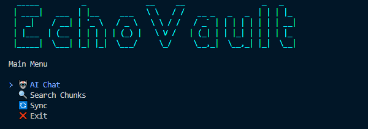
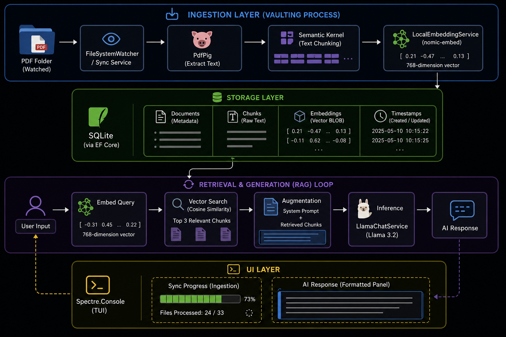

# EchoVault 


**Local Intelligence. Private Documentation.**

EchoVault is a high-performance RAG (Retrieval-Augmented Generation) system built with .NET 9. It allows users to index local PDF documents into a SQLite vector store and interact with them using local LLMs (Llama 3.2). **No data ever leaves your machine.**

---

## Features

- **Local Ingestion:** Extracts text from PDFs using `PdfPig`.
- **Vector Search:** Semantic chunking and embedding via `nomic-embed-text`.
- **AI Chat:** Context-aware responses using `Llama-3.2-1B-Instruct`.
- **Privacy First:** Entirely offline; #API keys coming soon.
- **Modern TUI:** Interactive terminal interface built with `Spectre.Console`.

---

## Prerequisites

- **Operating System:** Windows (current build optimized for Windows).
- **Runtime:** [.NET 9.0 SDK](https://dotnet.microsoft.com/download/dotnet/9.0)
- **Hardware:** 8GB+ RAM (16GB recommended for LLM inference).

---

## Installation & Setup

### 1. Clone the Repository

```bash
git clone https://github.com/your-username/EchoVault.git
cd EchoVault
```

### 2. Configure create database
1. Install the EF Core tools: `dotnet tool install --global dotnet-ef`
2. Apply migrations: `dotnet ef database update`

### 3. Configure Environment

Create a `.env` file in the root directory:

```env
DB_CONNECTION="Data Source=vault.db"
MODEL_PATH="C:/Models/nomic-embed-text-v1.5.Q4_K_M.gguf"
CHAT_MODEL_PATH="C:/Models/Llama-3.2-1B-Instruct-Q4_K_M.gguf"
TEST_PDF_FOLDER="C:/Your/Path/To/PDFs"
```

### 4. Download Models

Download the following GGUF models from HuggingFace and place them in your `C:/Models/` folder:

- **Embedding:** [nomic-embed-text-v1.5](https://huggingface.co/nomic-ai/nomic-embed-text-v1.5-GGUF)
- **Chat:** [Llama-3.2-1B-Instruct](https://huggingface.co/bartowski/Llama-3.2-1B-Instruct-GGUF)

### 5. Run the Application

```bash
cd EchoVault.TUI
dotnet run
```

---

## System Architecture



### Architectural Breakdown

#### 1. Ingestion Layer (The "Vaulting" Process)

- The `FileSystemWatcher` (or Sync Service) monitors your designated PDF folder.
- `PdfPig` parses raw text from documents.
- **Semantic Kernel** (Text Chunking) breaks long documents into manageable segments to preserve context without hitting LLM token limits.
- `LocalEmbeddingService` transforms text chunks into 768-dimension vectors using the `nomic-embed` model.

#### 2. Storage Layer

- **SQLite** (via EF Core): Acts as the central brain. Stores document metadata, raw text chunks, and their corresponding vector embeddings (as BLOBs).

#### 3. Retrieval & Generation (RAG) Loop

1. **User Input:** The user asks a question via the Spectre.Console TUI.
2. **Vector Search:** The query is embedded, and a Cosine Similarity calculation runs against the SQLite database to find the top 3 most relevant text chunks.
3. **Augmentation:** The system constructs a "System Prompt" containing the raw PDF text as ground truth.
4. **Inference:** The `LlamaChatService` (Llama 3.2) processes the prompt and generates a natural language response based only on the provided context.

#### 4. UI Layer

- **Spectre.Console:** Manages the terminal state, rendering live progress bars for syncing and formatted panels for AI responses.